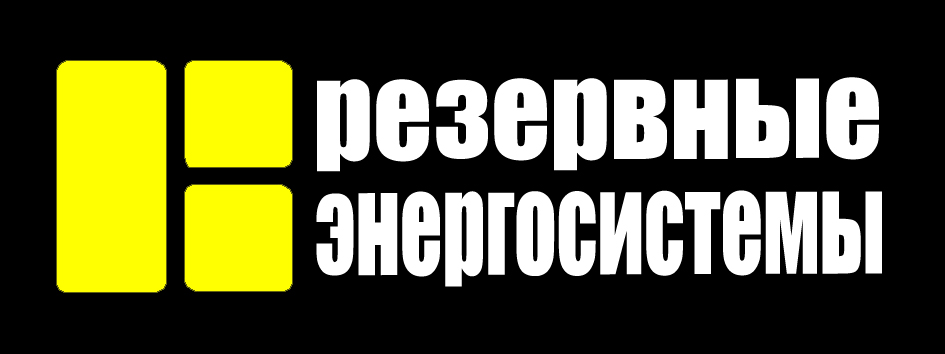

<!DOCTYPE html>
<html lang="ru">
<head>
<meta charset="UTF-8" />
<meta name="viewport" content="width=device-width, initial-scale=1.0" />
<title>Резервные энергосистемы</title>

</head>
<body>

<header>
  
 
</header>

<!-- Вкладки -->

  <button class="tab active" data-tab="1">Почему выбирают нас?</button>
  <button class="tab" data-tab="2">Что мы предлагаем </button>
  <button class="tab" data-tab="3">Связаться с нами</button>

<!-- Контент для вкладок -->

<h2>В вашем частном доме или даче часто отключают электричество?!? 
Снова авария на электросетях?!? 
Или Вы, как сознательный хозяин, заранее обеспокоены этим?

Мы обеспечим надежное бесперебойное электроснабжение вашего дома!
</h2>
  <ul>

     <h2>Предлагаем профессиональную установку систем резервного питания, для стабильной работы вашего дома в любых условиях.</li>
    <h2>Почему выбирают нас???</h2>
    <ul>
      <li>Быстрый монтаж и настройка</li>
      <li>Официальный договор</li>
      <li>Фиксированная стоимость, без скрытых платежей</li>
      <li>Гарантия качества и надежности</li>
      <li>Полный цикл работ: от консультации до запуска системы

</li> 
    </ul>
  </ul>
 <ul> <h2>   </h2></ul>

  <h2>Что мы предлагаем для Вас</h2>
  <li>Мощный генератор на 9 кВт. </li>

Этого хватит что бы без ограничения пользоваться всеми бытовыми приборами.

  <li>АВР (автоматический ввод резерва) </li>

Автоматика которая запусктит генератор в случае прекращения подачи электричества от сети и сама заглушит его, когда электричество вновь появится 

  <li>Бетонированная площадка под генератор </li>

 Фундамент снизит вибрации генератора, а так же убережет его от негативного влияния грунта

  <li>Короб для генератора </li>

Короб оснащен дополнительным глушителем, для снижения уровня шума от генератора, системой принудительной вентиляции с автоматикой для обеспечения оптимального температурного режима работы генератора.

В случае необходимости  мы можем установить дополнительную вибро-шумопоглащающий материал для еще большего снижения уровня шума

 <li>Только качественные материалы и комплектующие</li>

Все необходимые материалы уже входят в стоимость при размещении генератора на удалении до 10 м от дома.
 

  <h2>Связаться с нами</h2>
  
<a href="https://www.avito.ru/karpogory/predlozheniya_uslug/ustanovka_generatora_v_dom_7759720698?utm_campaign=native&utm_medium=item_page_android&utm_source=soc_sharing_seller" target="_blank" rel="noopener noreferrer">
    Перейти на страницу объявления на Авито
  </a>

 
 Номер для связи +7 911 

  Обеспечьте бесперебойное электроснабжение для вашего дома уже сегодня!

</body>
</html>
